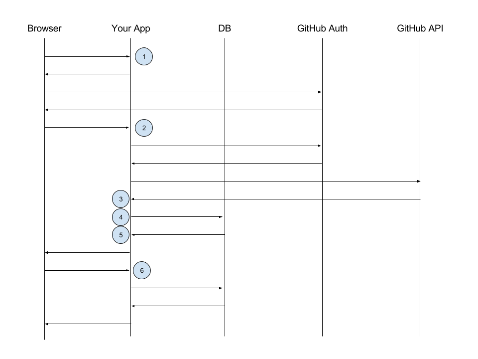

# OAuth with Passport

## What is oauth?
OAuth is an open standard for authorization, commonly used as a way for Internet users to authorize websites or applications to access their information on other websites but without giving them the passwords.

## Why is Oauth useful?
[Why Oauth](https://www.mashery.com/blog/why-oauth-20)

### Simplicity
When choosing an authentication protocol, the goal is to avoid heavy lifting on the development end, as well as make it easy on the API user once implemented into the flow. The last thing a user wants to do is to have to remember a new username and password in order to access a webservice.

### Security
OAuth 2.0 is also quite secure. We’re all familiar with valet services, and the so-called valet key that most cars come with. This key often only allows the car to be driven a particular distance, and typically does not unlock the trunk and glove box. OAuth is often referred to as a valet key for the web in that it grants an application access to protected data only for specific uses and often for a limited amount of time. For example, a browser game or mobile app will often request permission to access your Facebook profile and contacts. However, once you comply, the app cannot use that data for anything more than allowing you to play the game with friends and possibly post your in-game achievements to your Facebook page. Also, authentication via OAuth2.0 never requires actually passing user credentials from one app to another. Once the authentication and validation process begins, the user is driven to a secure URL where credentials are requested, but those credentials are never shared outside of that secure URL. Some people may see the decision to make tokens long-lived as a potential security concern. Supporting long-lived tokens or refresh tokens depends on the nature of your application, security constraints, and revenue models, among other factors. It’s early in our developer program’s lifespan, and a key to a successful API program is adapting quickly.  



> **NOTE**: The steps below correspond to the numbers in the diagram

## Step 1: Initial Request

To initiate a session, your user visits `/auth/github`.

This is an endpoint that you need to setup yourself, like so:

```js
app.get('/auth/github', passport.authenticate('github'));
```

> Question: What must `passport.authenticate('github') return, in JavaScript?`

> Answer: A function that has 3 parameters: `req, res, next`

`passport.authenticate('github')` does the following:

- generates a url
- redirects you to that URL

```
https://github.com/login/oauth/authorize?
  response_type=code
  &redirect_uri=http%3A%2F%2Flocalhost%3A3000%2Fauth%2Fgithub%2Fcallback
  &client_id=someclientid
```

### Step 1 Preparation

In order for Step 1 to work, you need to do the following:

- Create an Application in GitHub
- Grab the Client ID and Secret
- Run `yarn add passport passport-github`
- Add the following to `app.js`
  ```js
  const passport = require('passport')
  const GitHubStrategy = require('passport-github').Strategy
  app.use(passport.initialize())

  passport.use(new GitHubStrategy(
    {
      clientID: 'your-client-id',
      clientSecret: 'your-client-secret',
      callbackURL: 'http://localhost:3000/auth/github/callback',
      userAgent: 'your-app-name.your-domain.com'
    },

    // will be filled in later
    function() {
    }
  ));
  ```

`GitHubStrategy` is a pretty simple package.  It contains basic info about the endpoints and how to deal with them, such as:

- The Authorization server URL
- The Resource server URL (the API)
- A function that can parse the results of the API

When you call `passport.use(new GitHubStrategy({}, fn))` you are doing two things:

- "Filling in the blanks" of the GitHubStrategy with your app data
- Providing a function that will be called after the API data comes back
  - (Step 3 in the drawing above)

## Step 2: Setting up the callback route

Recall where we are:

- A user visited `/auth/github`
- Your `app.get('/auth/github', ...)` route sent them to GitHub
- GitHub asked you to login / authorize the app
- GitHub redirected you to `/auth/github/callback`

So now you need to setup that route:

```js
app.get('/auth/github/callback',
  passport.authenticate('github', { successRedirect: '/',
                                      failureRedirect: '/login' }))
```

This line sets up a route that:

- Looks at the `req.query` for a code
- If it finds it
  - Makes a call to GitHub to get an Access Token
  - Uses the Access Token to make a call to GitHub's API
  - Call the function you passed to `new GitHubStrategy({}, fn))`

### Step 3 / 4: Handle the API data

Now that you have API data, you need to do something with it:

```js
  passport.use(new GitHubStrategy(
    {
      clientID: 'your-client-id',
      clientSecret: 'your-client-secret',
      callbackURL: 'http://localhost:3000/auth/github/callback',
      userAgent: 'your-app-name.your-domain.com'
    },

    // This function gets called after the GitHub API call returns
    function onSuccessfulLogin(token, refreshToken, profile, done) {

      // This is a great place to find or create a user in the database
      // This function happens once after a successful login

      // Whatever you pass to `done` gets passed to `serializeUser`
      done(null, {token, user});
    }
  ));
```

> **NOTE** I named this function `onSuccessfulLogin` just so we can refer to it

The `onSuccessfulLogin` function gets called once after a successful login.  

## Step 4:  

You typically find/create a user in your database at this point, then call the `done` function.  Whatever you pass to the `done` function will also get passed to `serializeUser`.

## Step 5: serializeUser

Recall that at this point:

- The user has authenticated with GitHub
- You have an accessToken
- You have their user data from the GitHub API
- You've created a user in the database, and you have the user's database ID

Now you need to help connect all this information to your session.

To get the session wired up, you need 3 things:

- A session library of some sort
- A `serializeUser` function
- `app.use(passport.session())`

The lines you will have to add look like this:

```js
// you could also use express-session here
const cookieSession = require('cookie-session')
app.use(cookieSession({ secret: 'keyboard cat' }));

// this wires up passport's session code to your session
app.use(passport.session())

passport.serializeUser((object, done) => {
  done(null, {token: object.token})
})
```

In `serializeUser`, whatever you pass to `done` is the data that will be stored in your session (in this case in the session cookie).

You almost definitely want to put your user's database ID in the session, and you _may_ also want to put their access token (or you could store it in a database, or ignore it if you don't need to make further API calls).

## Step 6: Finding the user on every request

Every subsequent request will need to:

- Read the session to find the user's ID
- Find the user from that database with that ID
- Set `req.user` to that user object

So every request will trigger the function: `deserializeUser`:

```js
passport.deserializeUser((object, done) => {
    done(null, object)
})
```

Whatever you pass to `done` will be available to you as `req.user`
